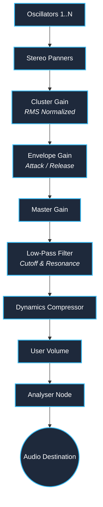

# 🎛️ Micro-Cluster Synth

**A high-density, microtonal web synthesizer for generating massive sonic textures and frequency clusters.**


---

## 📖 Overview

The **Micro-Cluster Synth** is a specialized browser-based instrument designed for **cluster synthesis**—a technique pioneered by composers like Henry Cowell and Iannis Xenakis, where dense clouds of microtonal frequencies are played simultaneously. 

Unlike traditional polyphonic synthesizers, this engine is built to handle hundreds or even thousands of simultaneous oscillators. By utilizing advanced gain-staging techniques (RMS normalization) and dynamic spatialization, it transforms microscopic frequency shifts into massive, evolving walls of sound without clipping the browser's audio engine.

> **Zero dependencies.** Built entirely with vanilla HTML, CSS, and the Web Audio API.

---

## ✨ Key Features

### 🎛️ Synthesis Engine
*   **Massive Polyphony:** Generate clusters of up to 1,000+ simultaneous oscillators.
*   **Dynamic Step Size:** Logarithmic control over frequency detuning (0.001 Hz to 50 Hz), allowing everything from imperceptible phasing to wide, dissonant clusters.
*   **Waveform Selection:** Sine, Triangle, Square, and Sawtooth waves with automatic gain compensation to maintain consistent perceived volume.

### 🎨 Tone Shaping & Spatialization
*   **Low-Pass Filtering:** Dedicated Cutoff (20Hz – 20kHz) and Resonance (Q) controls via a `BiquadFilterNode`.
*   **Stereo Spatialization:** Randomized stereo panning per-oscillator to create wide, immersive soundscapes from dense mono clusters.
*   **Amplitude Envelopes:** Fully adjustable Attack and Release times for everything from percussive plucks to infinite drone swells.

### ⚡ Audio Processing
*   **RMS Normalization:** Intelligent gain scaling (`1 / √N`) prevents clipping when scaling from 10 to 1,000 voices.
*   **Glue Compression:** A built-in `DynamicsCompressor` node acts as a master bus compressor, tightening the low-end and managing transient peaks.
*   **Real-Time Visualizer:** High-performance Canvas API rendering of the time-domain waveform.

---

## 🏗️ Audio Architecture

The Web Audio API routing graph is designed to handle extreme voice counts while maintaining headroom and stereo width.



---

## 🧠 Technical Deep Dive

### 1. Logarithmic Parameter Scaling
Human perception of frequency and time is logarithmic, not linear. All range sliders in the UI (Step Size, Filter Cutoff, Attack/Release) map linear slider values (0–100) to exponential audio parameters using the formula:
`value = min * (max / min)^(slider / 100)`

### 2. RMS Gain Normalization
Standard linear normalization (`1 / N`) makes large clusters inaudibly quiet. The Micro-Cluster Synth uses **Root-Mean-Square (RMS) normalization** (`1 / √N`). This assumes oscillators are partially uncorrelated in phase, keeping the perceived loudness consistent regardless of cluster size.

### 3. Waveform Compensation
Square and Sawtooth waves contain more harmonic energy and higher RMS levels than Sine waves. The engine applies automatic attenuation (`0.6` for Square, `0.7` for Sawtooth) at the cluster gain stage to prevent harsh volume jumps when switching waveforms.

---

## 🚀 Getting Started

Because this project uses vanilla JavaScript and the Web Audio API, there is no build step required.

### Local Development
1. Clone the repository:
   ```bash
   git clone https://github.com/yourusername/micro-cluster-synth.git
   cd micro-cluster-synth
   ```
2. Start a local server (required for some browser security policies regarding Web Audio):
   ```bash
   # Using Python 3
   python -m http.server 8000
   
   # Or using Node.js
   npx serve
   ```
3. Open your browser and navigate to `http://localhost:8000`.

> **Note:** Browsers require a user interaction (click/tap) to unlock the `AudioContext`. The UI handles this automatically on the first interaction.

---

## ⌨️ Keyboard Shortcuts

| Key | Action |
| :--- | :--- |
| <kbd>Space</kbd> | Toggle Play / Stop (when UI is not focused) |

---

## 🗺️ Roadmap

Future iterations of the Micro-Cluster Synth may include:
- [ ] **LFO Modulators:** Routing LFOs to Filter Cutoff, Stereo Spread, or Step Size.
- [ ] **Preset Management:** LocalStorage-based saving/loading of cluster configurations.
- [ ] **MIDI Support:** Web MIDI API integration for hardware controller mapping.
- [ ] **Spectral Visualizer:** FFT-based frequency domain visualization alongside the time-domain oscilloscope.
- [ ] **Delay/Reverb Bus:** Auxiliary sends for spatial effects.

---

## 🌐 Browser Compatibility

The Web Audio API is fully supported in all modern browsers:
*   ✅ Chrome / Edge (Chromium) v80+
*   ✅ Firefox v75+
*   ✅ Safari v14+ (Note: Safari requires explicit user gesture to start `AudioContext`, which is handled by the app's initialization logic).

---

## 📄 License

Distributed under the MIT License. See `LICENSE` for more information.

---

<p align="center">
  <i>Built for sound designers, ambient musicians, and fans of extreme polyphony.</i>
</p>
